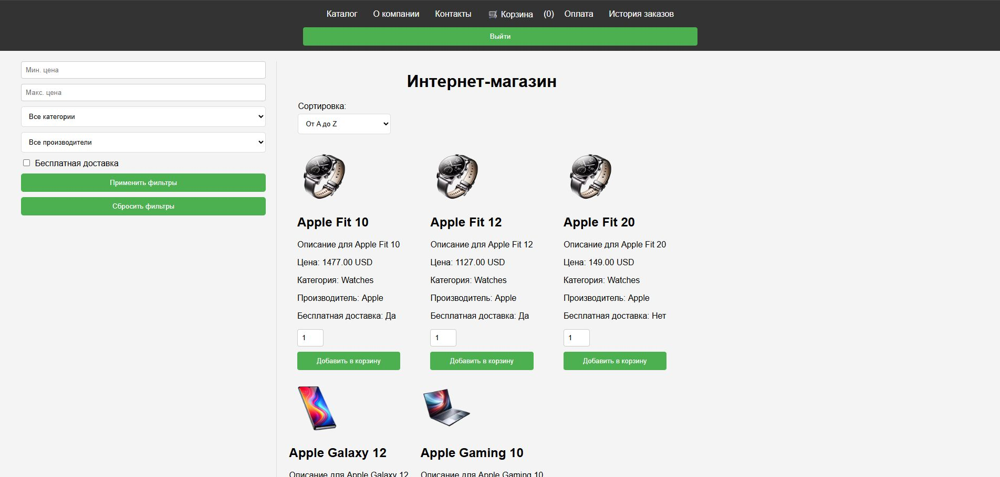
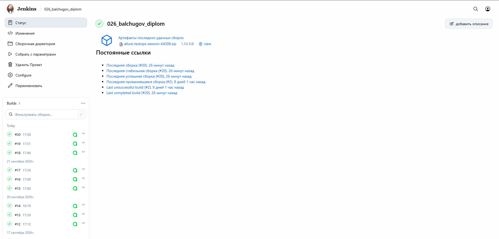

# Автоматизация тестирования Demoshopping

> [Ссылка на сайт](https://qa.demoshopping.ru/)



Автоматизация функционального тестирования веб-приложения Demoshopping.
Проект включает UI- и API-тесты, проверки позитивных и негативных сценариев, а также валидацию структуры API-запросов и ответов.

## Используемые технологии

* Python
* Pytest
* Selenium
* Selenium Page Factory
* Requests
* JSON Schema
* Allure
* Selenoid
* python-dotenv

## Что проверяем

### API

* ✅ Регистрация пользователя
* ✅ Авторизация пользователя
* ✅ Получение списка товаров
* ✅ Добавление товара
* ✅ Изменение товара
* ✅ Удаление товара
* ✅ Валидация тела запроса
* ✅ Валидация ответа API по JSON Schema
* ✅ Проверка HTTP status code

### WEB

* ✅ Регистрация пользователя
* ✅ Авторизация пользователя
* ✅ Работа с каталогом товаров
* ✅ Фильтрация товаров по цене, производителю, категории
* ✅ Проверка отображения товаров
* ✅ Проверка цен товаров


## Запуск проекта

Установить зависимости:

```bash
pip install -r requirements.txt
```
Для работы с удалённым браузером Selenoid необходимо создать файл `.env` в корне проекта.

## Jenkins

[Ссылка на сборку](https://jenkins.qa.guru/job/026_balchugov_diplom/)


Автоматизированные тесты запускаются в Jenkins.
В рамках сборки выполняются UI- и API-тесты, после чего формируется Allure Report.

## Allure report
[Пример отчета](https://jenkins.qa.guru/job/026_balchugov_diplom/9/allure/)


Allure используется для формирования наглядных отчётов о результатах выполнения автотестов.

В отчёте доступны:

- результаты выполнения тестов;
- шаги тестов;
- время выполнения;
- вложения.

Для UI-тестов дополнительно сохраняются скриншоты, HTML страницы, логи браузера и видео выполнения теста.

## Allure TestOps
[Пример запуска](https://allure.qa.guru/launch/56457)


Результаты автоматизированных тестов передаются в Allure TestOps, где можно отслеживать историю запусков, результаты тестов и их структуру.